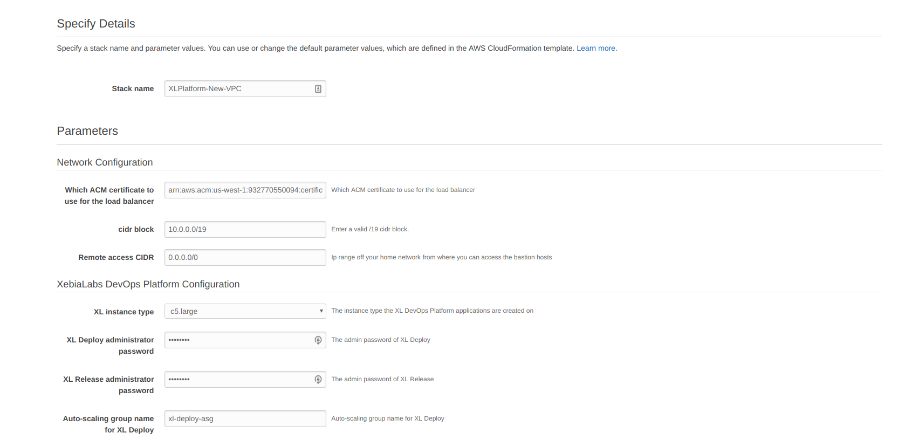
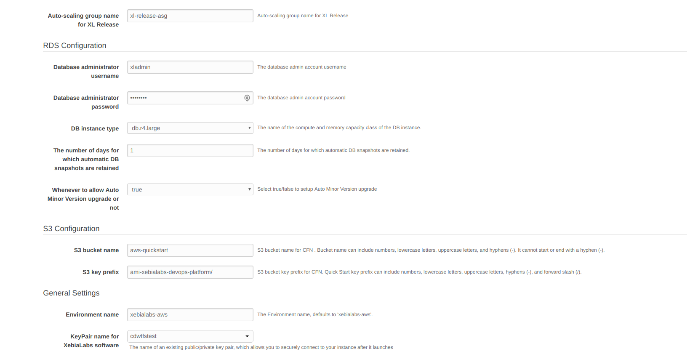
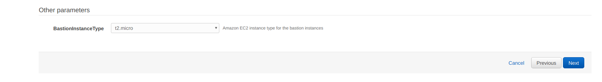
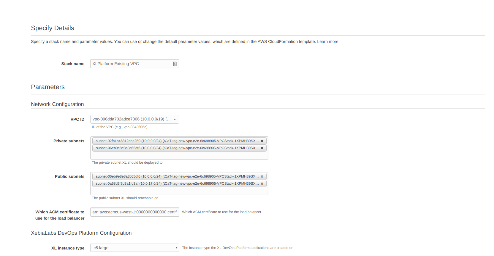
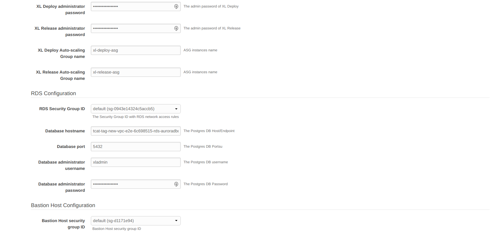
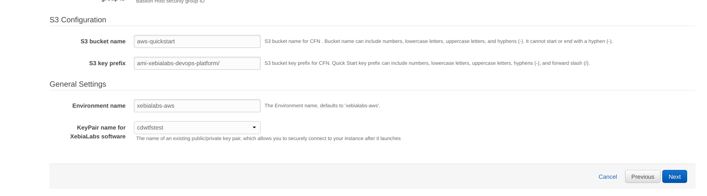
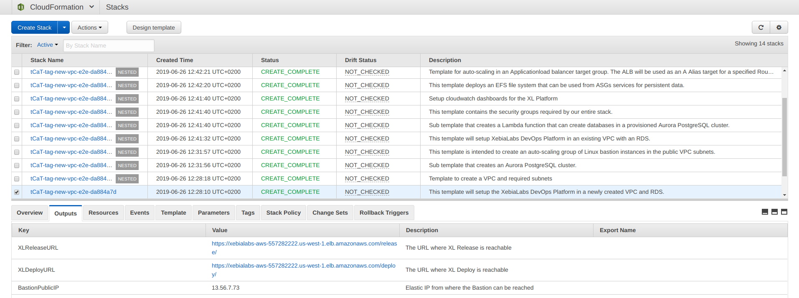

= XL Platform Installation on AWS Marketplace
:toc:

== Description

== Contents

This repository contains a set of AWS CloudFormation YAML templates that allows you to set up the XebiaLabs DevOps Platform on AWS. 

== AMI Description

The AMI used in this platform contains both XL Deploy and XL Release. Due to limitations on AWS' platform, this is currently the only way to distribute two products as a single listing. 

On startup, userdata provides details as to which product should be launched for a given auto-scaling group. 

The AMI is based on the latest Amazon Linux 2 image, which, at the time of writing this documentation, is `amzn2-ami-hvm-2.0.20190618-x86_64-gp2`. We strive to always keep the images up to date with the latest releases from AWS, in order to minimize any security attack surface. 

The same AMI will also be used for the bastion host in the Full Setup use case. No products will be running or available on these instances though, as the systemd services and products themselves will be removed at startup. 

== Setup Guide

This setup supports two use cases:

1. *Full Setup:* If an administrator chooses this option, the CloudFormation stack will create all resources required to run the XL Platform. This includes a new VPC, RDS cluster, bastion hosts, auto-scaling groups and all related security groups, subnets, internet gateways and NAT gateways. 
2. *Existing VPC & RDS Setup:* If an administrator chooses this option, the CloudFormation stack will only create the bare minimum infrastructure required to run the XL Platform. The administrator will need to provision the supporting infrastructure themselves. 

The exact resources provisioned, as well as an explanation of the purposes of the resources, can be found in the table below.

|========================================================================================================================================================================================================
| Resource                                                                                                                                                | Full Setup    | Existing VPC & +++ +++ RDS Setup

| https://docs.aws.amazon.com/vpc/latest/userguide/what-is-amazon-vpc.html[VPC]                                                                           | ✓             | 
| https://docs.aws.amazon.com/vpc/latest/userguide/VPC_Scenario2.html[Private Subnets]                                                                    | ✓             | 
| https://docs.aws.amazon.com/vpc/latest/userguide/VPC_Scenario1.html[Public Subnets]                                                                     | ✓             | 
| https://docs.aws.amazon.com/vpc/latest/userguide/VPC_Scenario2.html[Data Subnets]                                                                       | ✓             | 
| https://docs.aws.amazon.com/vpc/latest/userguide/egress-only-internet-gateway.html[Internet Gateway]                                                    | ✓             | 
| https://docs.aws.amazon.com/vpc/latest/userguide/vpc-eips.html[Elastic IP] for Bastion                                                                  | ✓             | 
| https://docs.aws.amazon.com/AmazonRDS/latest/UserGuide/Welcome.html[RDS] Instance                                                                       | ✓             | 
| Bastion https://docs.aws.amazon.com/autoscaling/plans/userguide/what-is-aws-auto-scaling.html[Auto-scaling Group]                                       | ✓             | 
| Databases within https://docs.aws.amazon.com/AmazonRDS/latest/UserGuide/Welcome.html[RDS]                                                               | ✓             | ✓
| https://docs.aws.amazon.com/elasticloadbalancing/latest/userguide/what-is-load-balancing.html[Application Load Balancer]                                | ✓             | ✓
| https://docs.aws.amazon.com/efs/latest/ug/getting-started.html[EFS] File System for XL Deploy                                                           | ✓             | ✓
| XL Release https://docs.aws.amazon.com/autoscaling/plans/userguide/what-is-aws-auto-scaling.html[Auto-scaling Group]                                    | ✓             | ✓
| XL Deploy https://docs.aws.amazon.com/autoscaling/plans/userguide/what-is-aws-auto-scaling.html[Auto-scaling Group]                                     | ✓             | ✓
| https://docs.aws.amazon.com/elasticloadbalancing/latest/userguide/how-elastic-load-balancing-works.html[Target groups] for XL Deploy and XL Release     | ✓             | ✓
| https://docs.aws.amazon.com/AmazonCloudWatch/latest/monitoring/CloudWatch_Dashboards.html[CloudWatch Dashboard]                                         | ✓             | ✓
| https://docs.aws.amazon.com/AmazonCloudWatch/latest/monitoring/AlarmThatSendsEmail.html[CloudWatch Alarms]                                              | ✓             | ✓
| https://docs.aws.amazon.com/AmazonCloudWatch/latest/logs/WhatIsCloudWatchLogs.html[CloudWatch Log Groups]                                               | ✓             | ✓
|========================================================================================================================================================================================================

=== Full Setup

When opting for this setup method, the administrator only needs to have the following AWS resources configured in order to deploy the XL Platform:

- A valid https://docs.aws.amazon.com/acm/latest/userguide/import-certificate.html[SSL/TLS certificate in Amazon Certificate Manager (ACM)] in order to expose the ALB endpoints over HTTPS
- A https://docs.aws.amazon.com/AWSEC2/latest/UserGuide/ec2-key-pairs.html[key pair] to SSH into the instances

The following is an example of the CloudFormation parameters -

NOTE: Should the administrator tear down the CloudFormation stack, the RDS instance will also be removed. A https://docs.aws.amazon.com/AmazonRDS/latest/UserGuide/USER_CreateSnapshot.html[snapshot] will however be automatically created prior to the database being deleted. The https://aws.amazon.com/backup/pricing/[cost] of this snapshot is dependent on the size of the databases at the time of deletion. 

=== Existing VPC & RDS Setup

When opting for this setup method, the administrator should already have the AWS resources as mentioned in the table above configured in order to deploy the XL Platform. In addition to these resources, the administrator will need to configure the following:

- A valid https://docs.aws.amazon.com/acm/latest/userguide/import-certificate.html[SSL/TLS certificate in Amazon Certificate Manager (ACM)] in order to expose the ALB endpoints over HTTPS
- A https://docs.aws.amazon.com/AWSEC2/latest/UserGuide/ec2-key-pairs.html[key pair] to SSH into the instances

NOTE: The public and private subnets are responsible for traffic segregation. Never expose your databases and other non-public services on public subnets. The only resource that should be directly attached to the public subnet should be your ALB

The following is an example of the CloudFormation parameters -

== Post setup

After the stack has been started up, the XL Release and XL Deploy endpoints, as well as the Elastic IP address of the bastion host (should the administrator have chosen the Full Setup installation option), will be part of the stack outputs. To find these, go to the https://us-west-1.console.aws.amazon.com/cloudformation/home?region=us-west-1[CloudFormation Console] in your chosen region, select the main/master stack and then click on "Outputs". Below is an example of the outputs:

